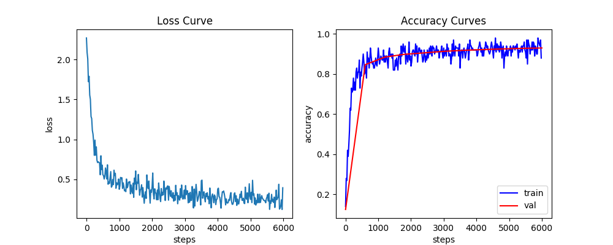
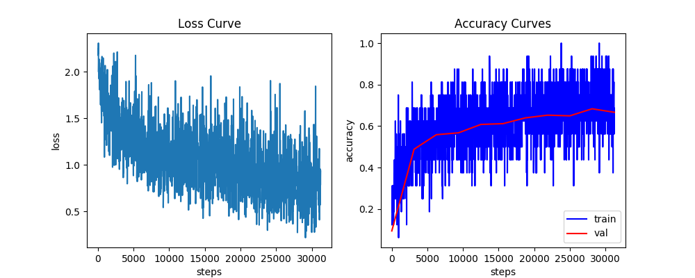

# numpy-deep-learning

A deep learning framework written from scratch using NumPy.

## Introduction

This is a vanilla deep learning framework which is implemented from scrach using pure NumPy library. The main purpose isn't, of course, to put together yet another powerful auto-grad library (with cpu-only NumPy, seriously?), but instead to document and summarize the math behind the most commonly seen deep learning building blocks when I recently reviewed them.

All the forward pass, backward pass, initialization, update, etc., are implemented with numpy matrix operations; no magic wrappers behind whatsoever. It's a good reference for practitioners in this field (might just be me) to review the basics, and also for people who just started to see how the black box (or more precisely, boxes) works under the scene.

Simply out of personal preference, Pytorch is chosen to be the "ground truth" reference to verify the implementation. Also, the interfaces have a similar style with Pytorch.

## Installation

Dependency:

- NumPy >= 1.18.0
- scikit-learn >= 0.20.0
- PyTorch (if you want to run the verification. cpu version will do; no need for gpu support.)

Clone the repository and set up python search path:

```bash
git clone https://github.com/DianCh/numpy-deep-learning.git
export PYTHONPATH=<your-chosen-location>/numpy-deep-learning:$PYTHONPATH
```

## Experiments

The deep learning components are packaged into `ndl`, while scripts of different experiments are grouped under `experiments`. Before running the experiments, please run the following the script to get **MNIST** and **CIFAR10** datasets ready on your local machine:

```bash
python prepare_data.py
```

Then by default you should have the follow folders for your data inside this repo:

```bash
├── data
│   ├── cifar-10-batches-py
│   └── mnist-784
```

If you prefer to put data elsewhere, you can also achieve that by setting `NDL_DATA_ROOT` environment variable.

(Note: currently this vanilla framework doesn't support accumulating gradients of **multiple forward passes**; only the **last** forward pass will count.)

### Numerical Verification

### Multi-Layer Perceptron

In this experiment, we are going to train a Multi-Layer Perceptron classifier to classify hand-written digits from the **MNIST dataset**. Run the following script with data root pointing to where you put MNIST dataset (if you didn't specify a custom location with , then it's simply `data/mnist-784`):

```bash
python experiments/mnist_mlp.py <your-data-root>/mnist-784
```

To save the complexity from creating config files or making argument parsers, **configurations & hyperparameters** (number of epochs, batch size, learning rate, etc., see `__main__` block) can be directly modified inside `experiments/mnist_mlp.py`.

The script will:

- build an MLP classifier
- train the classifier on MNIST train split
- evaluate the classifier on MNIST test split

During the experiment, you should see metrics being printed along the way. You can also set `show_curve=True` in the `__main__` to draw the loss & accuracy curves which will be saved as `metrics.png`. As an example, with the default settings in the script, you can get something similar to this plot, with accuracy converged to approx. `0.94`:



If you are interested in seeing how the model performs on classifying each digit, you can get a result breakdown the looks like:

```bash
Test accuracy after 10 epochs: 0.938
Accuracy of digit 0: 0.978
Accuracy of digit 1: 0.981
Accuracy of digit 2: 0.904
Accuracy of digit 3: 0.927
Accuracy of digit 4: 0.925
Accuracy of digit 5: 0.899
Accuracy of digit 6: 0.936
Accuracy of digit 7: 0.927
Accuracy of digit 8: 0.884
Accuracy of digit 9: 0.915
```

As a reference, the experiment with the default settings finishes within approx. 10 seconds on my i7 macbook pro.

### Convolutional Neural Network

In this experiment, we are going to train a classifier to recognize objects on the **CIFAR10 dataset**, but this time with a Convolutional Neural Network. Similarly to the MLP experiment, run the following script with your data root provided, which now should point to the CIFAR10 dataset (by default `data/cifar-10-batches-py`):

```bash
python experiments/cifar10_cnn.py <your-data-root>/cifar-10-batches-py
```

Similarly, don't forget to play around with **configurations & hyperparameters** in the `__main__` block of the script.

The default model provided has several convolutional layers which are followed by several fully connected layers. Feel free to experiment with your own architecture with building blocks from `ndl.layers` (but maybe don't go too wild since the computation might become really **slow** if you throw in too many layers, well, if you want to finish the training).

The script will:

- build a classifier using convolutional layers & fully connected layers
- train the classifier on CIFAR10 train split
- evaluate the classifier on CIFAR10 test split

In this experiment, you will probably notice that the training is **much slower** than our last MLP experiment. This is mainly because the number of operations (#multiplication, #addition) involved with the layers boosted (try to verify this yourself with a pen on a piece of paper!). Also since the NumPy operations aren't quite optimized (both my implementation and Numpy itself) as well as Pytorch in terms of manipulating tensors，the slow-down becomes noticeable.

With the provided default settings, you can get a plot similar to this (accuracy converged to approx. `0.67`):



The breakdown accuracy for each class looks like something to:

```bash
Test accuracy after 10 epochs: 0.667
Accuracy of plane: 0.755
Accuracy of car: 0.836
Accuracy of bird: 0.583
Accuracy of cat: 0.459
Accuracy of deer: 0.425
Accuracy of dog: 0.582
Accuracy of frog: 0.825
Accuracy of horse: 0.711
Accuracy of ship: 0.825
Accuracy of truck: 0.665
```

### Speed Benchmark

This experiment is for testing out the running speed of some NumPy-implemented layers. Specifically, for `Conv2D` and `Pool2D`, I've used 3 levels of vectorization to implement their forward pass and backward pass, which included 2-layer, 3-layer and 4-layer for-loops (if you don't know what I'm talking about you may go check `ndl.layers.conv2d` and `ndl.layers.pool2d`). I've also included a simulated im2col (an technique for optimizing the speed of 2D convolution, which I found super cool) implementation for `Conv2D`.

Simply run:

```bash
python experiments/layers_benchmark.py
```

Again, as a reference, the output on my macbook looks like:

## Math Step-by-Step
### Linear
### Conv2D
### Initialization
### Pool2D
### ReLU
### CrossEntropyLoss


## License